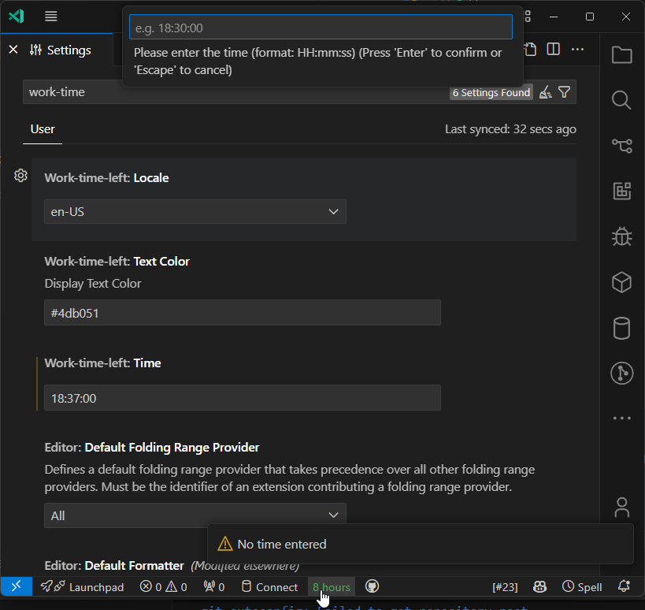

# Work Time Left

Display the time left in the work day in the status bar.

- locale support

## Example


## Extension Settings

also you can click on the status bar to set the time.



## Command

```json
{
  "command": "work-time-left.setTime",
  "title": "Set Time"
}
```

## License

[LGPL 3.0](./LICENSE) License © 2024 [BjornLi](https://github.com/lxxorz)
