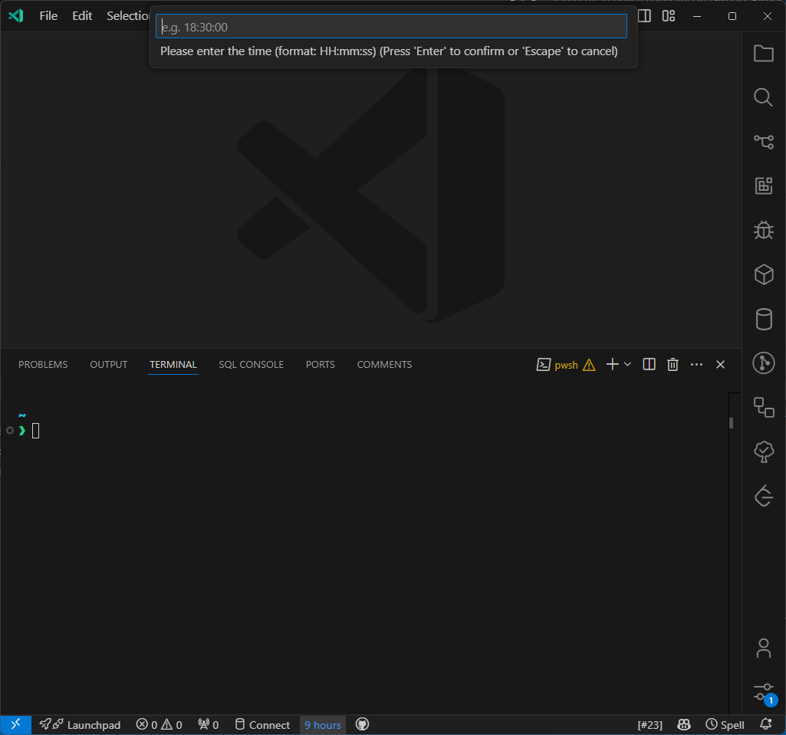
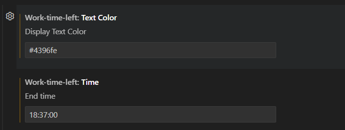

# work-time-left README

Display the time left in the work day in the status bar.

## Example



## Extension Settings

This extension contributes the following settings:



Command

```json
{
  "command": "work-time-left.setTime",
  "title": "Set Time"
}
```
