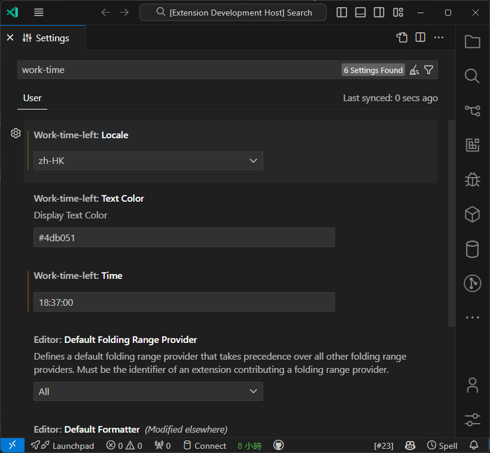

# Work Time Left

Display the time left in the work day in the status bar.

- locale support

## Example

## Configurations

<!-- configs -->

| Key                           | Description                                     | Type      | Default                                                       |
| ----------------------------- | ----------------------------------------------- | --------- | ------------------------------------------------------------- |
| `work-time-left.time`         |                                                 | `string`  | `"18:49:00"`                                                  |
| `work-time-left.textColor`    | Display text color                              | `string`  | `"#4db051"`                                                   |
| `work-time-left.locale`       |                                                 | `string`  | `"en-US"`                                                     |
| `work-time-left.enableRemind` |                                                 | `boolean` | `true`                                                        |
| `work-time-left.remindTime`   | When to remind you to call it a day, in minutes | `number`  | `5`                                                           |
| `work-time-left.remindText`   |                                                 | `string`  | `"Great job today! It's time to call it a day and unwind.🌇"` |

<!-- configs -->

also you can click on the status bar to set the time.

## Commands

<!-- commands -->

| Command                  | Title            |
| ------------------------ | ---------------- |
| `work-time-left.setTime` | update work time |

<!-- commands -->

## License

[AGPL-3.0-only](./LICENSE) License © 2024 [BjornLi](https://github.com/lxxorz)
